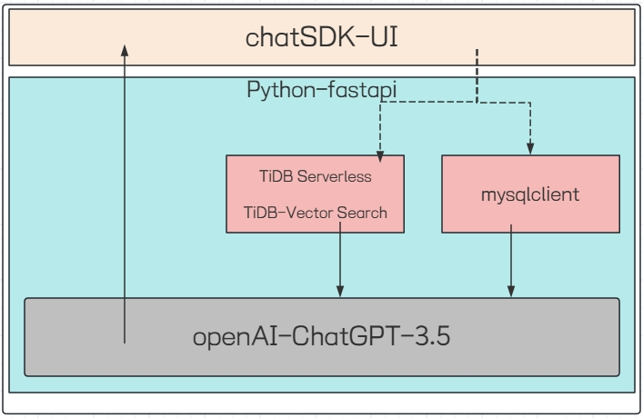
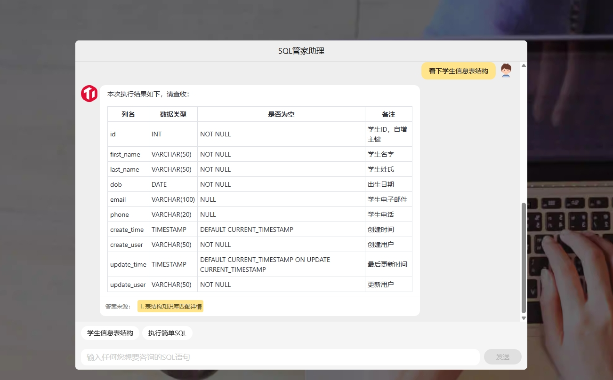
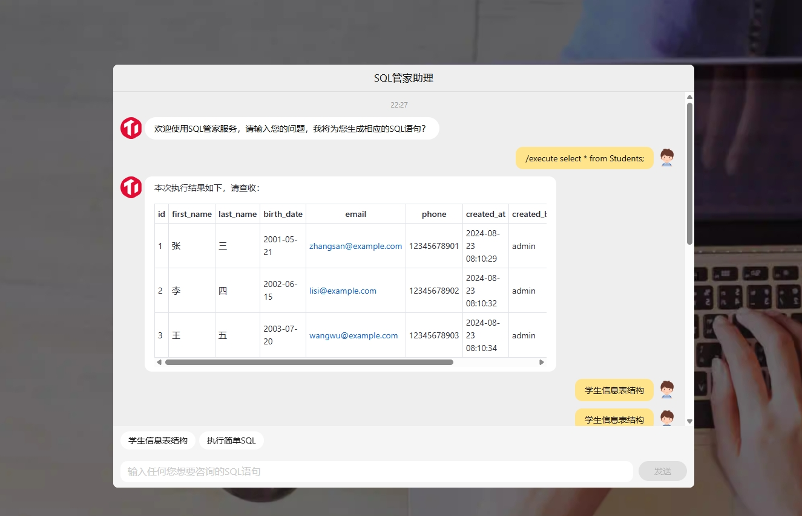

# python-tidb-chat2sql

Utilize Python and TiDB vector database to create text-to-SQL functionality and provide related data retrieval and viewing, as well as the ability to execute SQL queries and other operations.


# Simple UI

This example uses Alibaba's open-source chatSDK to implement a simple UI, allowing users to quickly experience the demo example by clicking on shortcut phrases.

## Prerequisites

- A running TiDB Serverless cluster with vector search enabled
- Python 3.8 or later
- OpenAI [API key](https://platform.openai.com/docs/quickstart)

## Run the example

### Clone this repo

```bash
git clone https://github.com/StudiousXiaoYu/python-tidb-chat2sql.git
```

### Install dependencies

```bash
pip install -r requirements.txt
```

### Set the environment variables

Get the `OPENAI_API_KEY` from [OpenAI](https://platform.openai.com/docs/quickstart)

Get the `TIDB_HOST`, `TIDB_USERNAME`, and `TIDB_PASSWORD` from the TiDB Cloud console, as described in the [Prerequisites](../README.md#prerequisites) section.

Set environment variables in `example.py`.

```bash
# 默认配置
os.environ['OPENAI_API_BASE'] = 'https://***'
os.environ['OPENAI_API_KEY'] = '***'
os.environ['TIDB_HOST'] = 'gateway01.***'
os.environ['TIDB_USERNAME'] = '***'
os.environ['TIDB_PASSWORD'] = '***'
```

### Prepare data and run the server

```bash
# prepare the data
python example.py prepare

# runserver
python example.py runserver
```

Now you can visit [http://127.0.0.1:3000/](http://127.0.0.1:3000/) to interact with the RAG application.

# Capability demonstration

Here are all the components we are currently using: tidb-serverless, openai, tidb-vector, mysqlclient, chatSDK.

- **chatSDK**: UI display
- **tidb-vector**: Vector storage and semantic similarity queries
- **openai**: Utilizes ChatGPT-3.5 for Q&A
- **mysqlclient**: Executes SQL queries



## Schema matching

When a user's query matches the stored table structure names in the knowledge base, a TIDB-vector search is performed, followed by an SQL knowledge base search. The retrieved content is then provided to OpenAI LLM for answering related SQL questions.

### Example


## SQL execution

After the user sends the /execute command, SQL execution will occur, and the result will be returned to the user. However, DML statements like drop and create cannot be used. Query statements should be used whenever possible.

### Example

